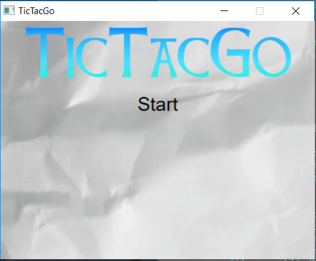
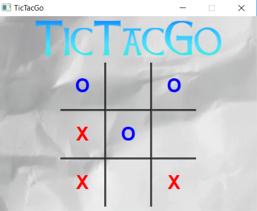

# TicTacGo

Little Project made during my _3rd year University_ (for fun)

***

___The goal is to develop a TicTacToe Game in Golang___

***

___Specification:___

 - Back:  `GoLang`
 - Front: `HTML` (Using webview)
   

***

___run the project:___  
get librarie for front:  
`go get github.com/zserge/webview`

build:  
`go build -ldflags="-H windowsgui" -o TicTacGo.exe`

<table>
    <tr>
        <td>
            
        </td>
        <td>
            
        </td>
        <td>
            
        </td>
    </tr>
</table>

***

Thanks to Serge Zaitsev for his amazing [webview](https://github.com/zserge/webview) package!
